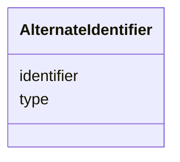

```mermaid
 classDiagram
    class AlternateIdentifier
    click AlternateIdentifier href "../AlternateIdentifier"
      AlternateIdentifier : identifier
        
      AlternateIdentifier : type
        
      
```
