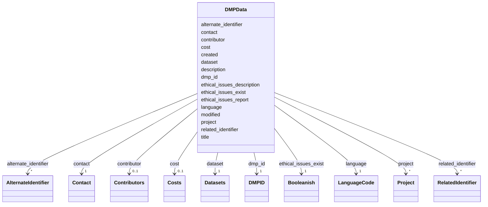

```mermaid
 classDiagram
    class DMPData
    click DMPData href "../DMPData"
      DMPData : alternate_identifier
        
          
    
        
        
        DMPData --> "*" AlternateIdentifier : alternate_identifier
        click AlternateIdentifier href "../AlternateIdentifier"
    

        
      DMPData : contact
        
          
    
        
        
        DMPData --> "1" Contact : contact
        click Contact href "../Contact"
    

        
      DMPData : contributor
        
          
    
        
        
        DMPData --> "0..1" Contributors : contributor
        click Contributors href "../Contributors"
    

        
      DMPData : cost
        
          
    
        
        
        DMPData --> "0..1" Costs : cost
        click Costs href "../Costs"
    

        
      DMPData : created
        
      DMPData : dataset
        
          
    
        
        
        DMPData --> "1" Datasets : dataset
        click Datasets href "../Datasets"
    

        
      DMPData : description
        
      DMPData : dmp_id
        
          
    
        
        
        DMPData --> "1" DMPID : dmp_id
        click DMPID href "../DMPID"
    

        
      DMPData : ethical_issues_description
        
      DMPData : ethical_issues_exist
        
          
    
        
        
        DMPData --> "1" Booleanish : ethical_issues_exist
        click Booleanish href "../Booleanish"
    

        
      DMPData : ethical_issues_report
        
      DMPData : language
        
          
    
        
        
        DMPData --> "1" LanguageCode : language
        click LanguageCode href "../LanguageCode"
    

        
      DMPData : modified
        
      DMPData : project
        
          
    
        
        
        DMPData --> "*" Project : project
        click Project href "../Project"
    

        
      DMPData : related_identifier
        
          
    
        
        
        DMPData --> "*" RelatedIdentifier : related_identifier
        click RelatedIdentifier href "../RelatedIdentifier"
    

        
      DMPData : title
        
      
```
