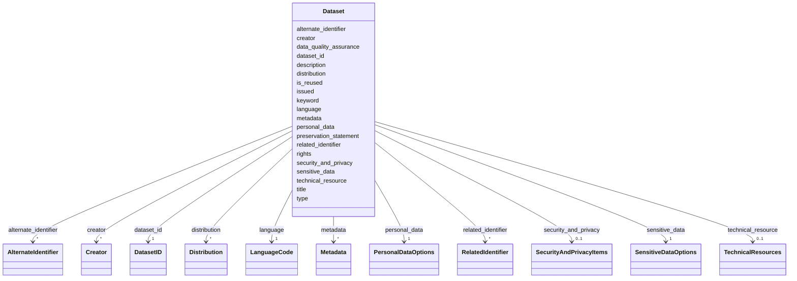

```mermaid
 classDiagram
    class Dataset
    click Dataset href "../Dataset"
      Dataset : alternate_identifier
        
          
    
        
        
        Dataset --> "*" AlternateIdentifier : alternate_identifier
        click AlternateIdentifier href "../AlternateIdentifier"
    

        
      Dataset : creator
        
          
    
        
        
        Dataset --> "*" Creator : creator
        click Creator href "../Creator"
    

        
      Dataset : data_quality_assurance
        
      Dataset : dataset_id
        
          
    
        
        
        Dataset --> "1" DatasetID : dataset_id
        click DatasetID href "../DatasetID"
    

        
      Dataset : description
        
      Dataset : distribution
        
          
    
        
        
        Dataset --> "*" Distribution : distribution
        click Distribution href "../Distribution"
    

        
      Dataset : is_reused
        
      Dataset : issued
        
      Dataset : keyword
        
      Dataset : language
        
          
    
        
        
        Dataset --> "1" LanguageCode : language
        click LanguageCode href "../LanguageCode"
    

        
      Dataset : metadata
        
          
    
        
        
        Dataset --> "*" Metadata : metadata
        click Metadata href "../Metadata"
    

        
      Dataset : personal_data
        
          
    
        
        
        Dataset --> "1" PersonalDataOptions : personal_data
        click PersonalDataOptions href "../PersonalDataOptions"
    

        
      Dataset : preservation_statement
        
      Dataset : related_identifier
        
          
    
        
        
        Dataset --> "*" RelatedIdentifier : related_identifier
        click RelatedIdentifier href "../RelatedIdentifier"
    

        
      Dataset : rights
        
      Dataset : security_and_privacy
        
          
    
        
        
        Dataset --> "0..1" SecurityAndPrivacyItems : security_and_privacy
        click SecurityAndPrivacyItems href "../SecurityAndPrivacyItems"
    

        
      Dataset : sensitive_data
        
          
    
        
        
        Dataset --> "1" SensitiveDataOptions : sensitive_data
        click SensitiveDataOptions href "../SensitiveDataOptions"
    

        
      Dataset : technical_resource
        
          
    
        
        
        Dataset --> "0..1" TechnicalResources : technical_resource
        click TechnicalResources href "../TechnicalResources"
    

        
      Dataset : title
        
      Dataset : type
        
      
```
