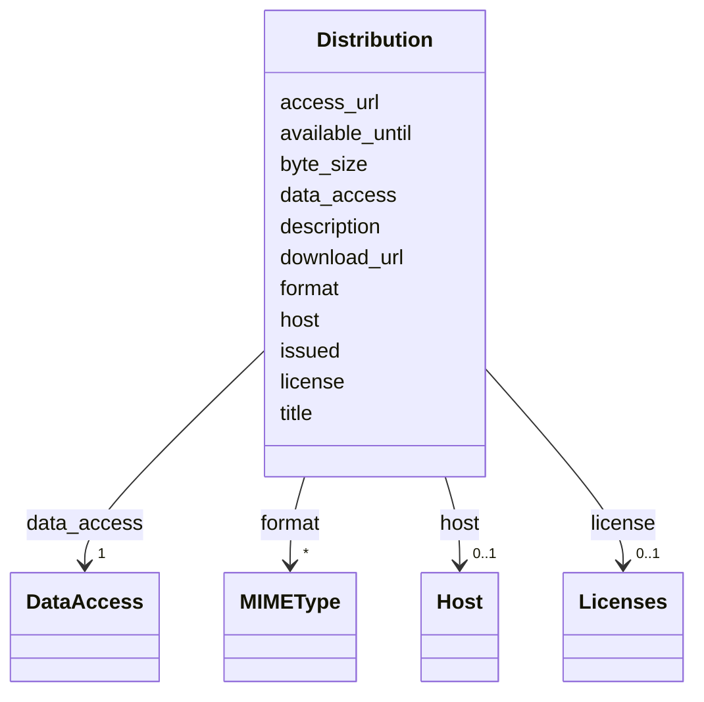

```mermaid
 classDiagram
    class Distribution
    click Distribution href "../Distribution"
      Distribution : access_url
        
      Distribution : available_until
        
      Distribution : byte_size
        
      Distribution : data_access
        
          
    
        
        
        Distribution --> "1" DataAccess : data_access
        click DataAccess href "../DataAccess"
    

        
      Distribution : description
        
      Distribution : download_url
        
      Distribution : format
        
          
    
        
        
        Distribution --> "*" MIMEType : format
        click MIMEType href "../MIMEType"
    

        
      Distribution : host
        
          
    
        
        
        Distribution --> "0..1" Host : host
        click Host href "../Host"
    

        
      Distribution : issued
        
      Distribution : license
        
          
    
        
        
        Distribution --> "0..1" Licenses : license
        click Licenses href "../Licenses"
    

        
      Distribution : title
        
      
```
