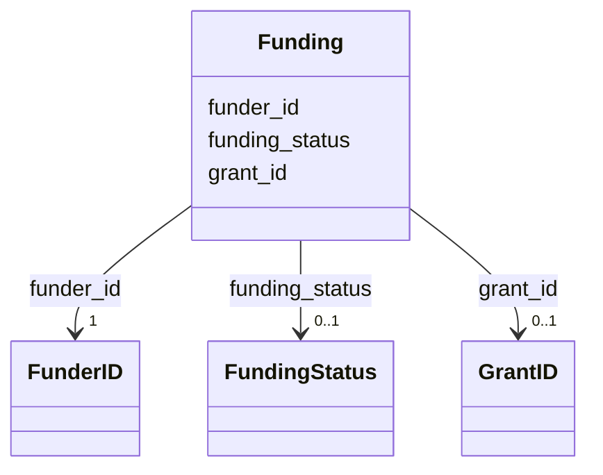

```mermaid
 classDiagram
    class Funding
    click Funding href "../Funding"
      Funding : funder_id
        
          
    
        
        
        Funding --> "1" FunderID : funder_id
        click FunderID href "../FunderID"
    

        
      Funding : funding_status
        
          
    
        
        
        Funding --> "0..1" FundingStatus : funding_status
        click FundingStatus href "../FundingStatus"
    

        
      Funding : grant_id
        
          
    
        
        
        Funding --> "0..1" GrantID : grant_id
        click GrantID href "../GrantID"
    

        
      
```
