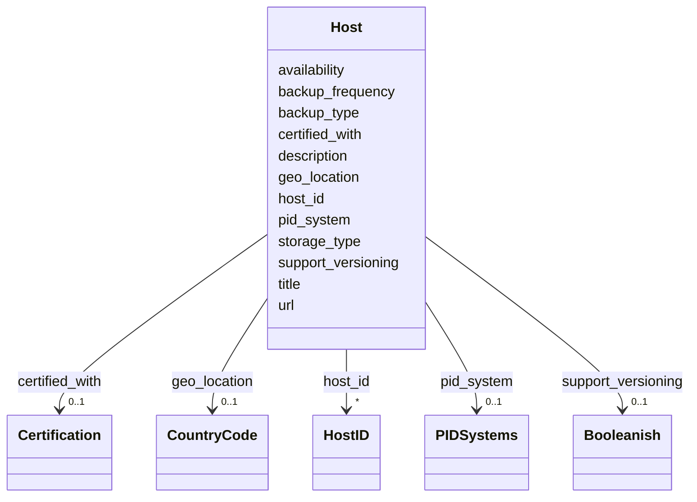

```mermaid
 classDiagram
    class Host
    click Host href "../Host"
      Host : availability
        
      Host : backup_frequency
        
      Host : backup_type
        
      Host : certified_with
        
          
    
        
        
        Host --> "0..1" Certification : certified_with
        click Certification href "../Certification"
    

        
      Host : description
        
      Host : geo_location
        
          
    
        
        
        Host --> "0..1" CountryCode : geo_location
        click CountryCode href "../CountryCode"
    

        
      Host : host_id
        
          
    
        
        
        Host --> "*" HostID : host_id
        click HostID href "../HostID"
    

        
      Host : pid_system
        
          
    
        
        
        Host --> "0..1" PIDSystems : pid_system
        click PIDSystems href "../PIDSystems"
    

        
      Host : storage_type
        
      Host : support_versioning
        
          
    
        
        
        Host --> "0..1" Booleanish : support_versioning
        click Booleanish href "../Booleanish"
    

        
      Host : title
        
      Host : url
        
      
```
