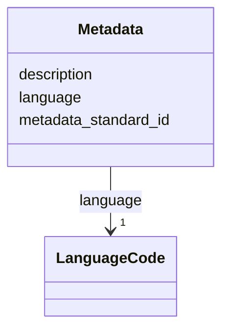

```mermaid
 classDiagram
    class Metadata
    click Metadata href "../Metadata"
      Metadata : description
        
      Metadata : language
        
          
    
        
        
        Metadata --> "1" LanguageCode : language
        click LanguageCode href "../LanguageCode"
    

        
      Metadata : metadata_standard_id
        
      
```
