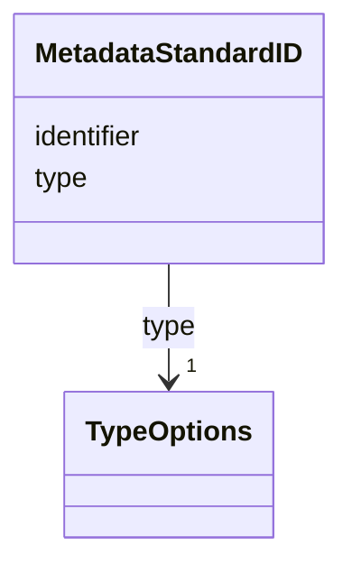

```mermaid
 classDiagram
    class MetadataStandardID
    click MetadataStandardID href "../MetadataStandardID"
      MetadataStandardID : identifier
        
      MetadataStandardID : type
        
          
    
        
        
        MetadataStandardID --> "1" TypeOptions : type
        click TypeOptions href "../TypeOptions"
    

        
      
```
