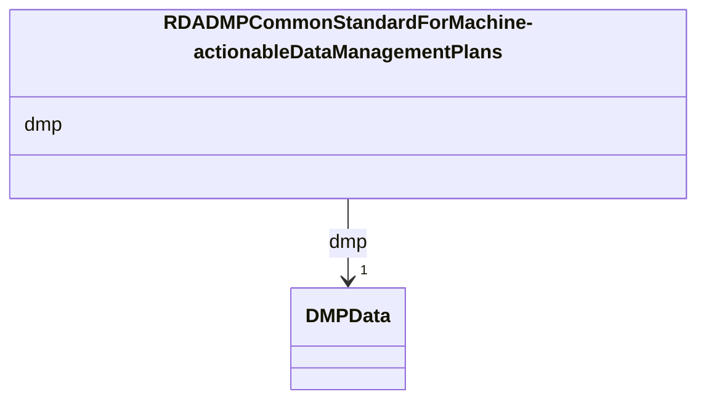

```mermaid
 classDiagram
    class RDADMPCommonStandardForMachine-actionableDataManagementPlans
    click RDADMPCommonStandardForMachine-actionableDataManagementPlans href "../RDADMPCommonStandardForMachine-actionableDataManagementPlans"
      RDADMPCommonStandardForMachine-actionableDataManagementPlans : dmp
        
          
    
        
        
        RDADMPCommonStandardForMachine-actionableDataManagementPlans --> "1" DMPData : dmp
        click DMPData href "../DMPData"
    

        
      
```
