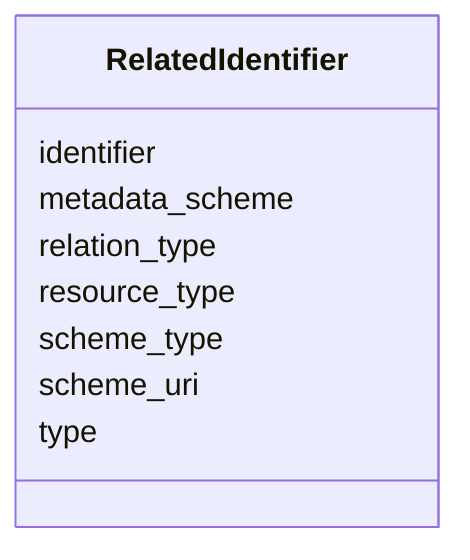

```mermaid
 classDiagram
    class RelatedIdentifier
    click RelatedIdentifier href "../RelatedIdentifier"
      RelatedIdentifier : identifier
        
      RelatedIdentifier : metadata_scheme
        
      RelatedIdentifier : relation_type
        
      RelatedIdentifier : resource_type
        
      RelatedIdentifier : scheme_type
        
      RelatedIdentifier : scheme_uri
        
      RelatedIdentifier : type
        
      
```
